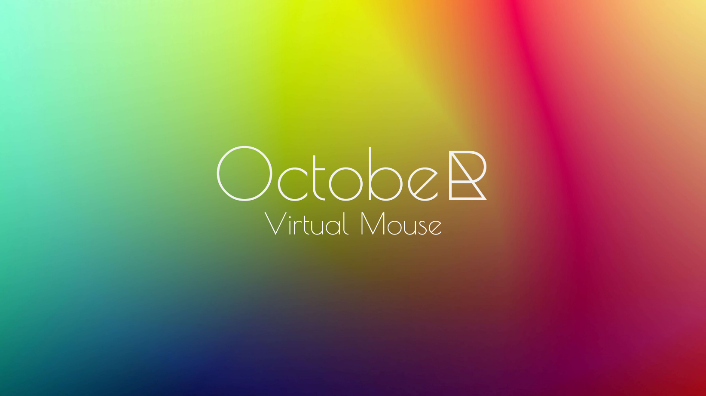

## Introduction

October is an innovative virtual assistant designed specifically for desktop computers. The primary goal of October is to provide users with the ability to control their mouse pointer using only voice commands. This can be particularly beneficial for individuals with mobility impairments, offering them an easier and more efficient way to navigate and interact with their computer systems.

## Features

### Voice-Controlled Mouse Pointer
October enables users to move their mouse pointer and perform various actions such as clicking, double-clicking, and dragging through voice commands. This feature significantly enhances accessibility and can improve the overall user experience for those who find traditional input devices challenging to use.

### Speech Recognition
October leverages the Google Speech Recognition API to accurately interpret and process voice commands. This integration ensures that the virtual assistant can understand a wide range of voice inputs with high accuracy, making it a reliable tool for everyday use.

### Multiprogramming Capabilities
The application is built using advanced multiprogramming concepts in Python, which allows it to handle multiple tasks simultaneously. This ensures that October can respond to voice commands in real-time while managing other background processes efficiently.

## Technical Implementation

### Python
Python is the primary programming language used for developing October. Its simplicity and extensive library support make it an ideal choice for creating a robust and scalable virtual assistant.

### Google Speech Recognition API
The Google Speech Recognition API is integrated into October to provide high-quality voice recognition services. This API converts spoken language into text, which October then interprets to execute the appropriate mouse actions.

### Multiprogramming
October's architecture is designed using multiprogramming principles, enabling it to perform multiple operations concurrently. This design ensures that voice commands are processed quickly and that the virtual assistant remains responsive during extended use.

## How It Works

1. **Initialization**: Upon launching October, the application initializes the speech recognition engine and prepares to receive voice commands.

2. **Listening for Commands**: October continuously listens for voice inputs from the user. The audio data is captured and sent to the Google Speech Recognition API for processing.

3. **Processing Voice Commands**: The speech recognition API converts the audio input into text. October then parses this text to determine the appropriate action to perform with the mouse pointer.

4. **Executing Mouse Actions**: Based on the parsed commands, October moves the mouse pointer, clicks, double-clicks, or performs other mouse-related actions as instructed by the user.

## Benefits

- **Accessibility**: October provides an alternative input method for users with physical disabilities, allowing them to interact with their computers more easily.
- **Efficiency**: Voice commands can be quicker and more intuitive for certain tasks, improving overall productivity.
- **User-Friendly**: The application is designed to be easy to use, requiring minimal setup and offering a straightforward interface for voice command input.

## Conclusion

October is a powerful virtual assistant that enhances desktop computer accessibility through voice-controlled mouse pointer manipulation. By utilizing Python, the Google Speech Recognition API, and multiprogramming concepts, October delivers a responsive and reliable tool for users seeking an alternative to traditional input devices. Whether for accessibility purposes or simply to streamline workflow, October represents a significant advancement in voice-controlled technology for desktop computing.
